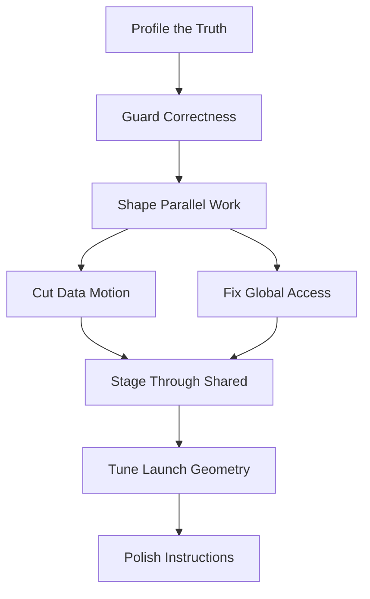

# CUDA 主节点性能优化探索计划

## 1. 计划目标

本计划基于以下两份材料整理：

- `docs/treasure-map/cuda-route-nodes.md`
- `docs/optimization/cuda-operator-optimization-best-practices.md`

计划范围暂时只覆盖 CUDA 性能优化主节点，不展开支线节点。探索周期按 `3` 人、`8` 周设计，人员为 `小A`、`小B`、`小C`。排期目标是：

- 沉淀面向 `950` 的 `SIMD & SIMT` 混合编程性能优化能力，为后续支撑客户开发高性能算子做准备。
- 优先覆盖全部主节点，保持主干依赖顺序，逐步形成适配 `SIMT` 场景的优化主路径。
- 结合优化项输出真实场景、具备泛化能力的最佳实践样例算子，并给出与当前算子库、`H800 Torch` 算子的性能对比。
- 通过多版本 `SIMT` 算子对比，展示优化路径和各阶段收益，沉淀可复用的优化过程样例。
- 全面体验产品侧性能调试工具，并结合与 `NVIDIA` 工具链的差异，向产品侧输出改进需求。

实现路径：

- 从客户真实场景中筛选代表性样例算子，作为优化探索和对比分析的输入。
- 以 CUDA 最佳实践为参考，逐步摸索适配 `950` 芯片的 `SIMD & SIMT` 混合编程优化路径。

## 2. 主节点拓扑排序简图



说明：

- 前三层是三个人共享的前置主干。
- 中段按 `Cut Data Motion` 和 `Fix Global Access` 分流推进。
- 后段在 `Stage Through Shared`、`Tune Launch Geometry`、`Polish Instructions` 逐步收敛。

## 3. 三人探索路径概览

```text
小A: Profile -> Guard -> Shape -> Cut Data Motion -> Fix Global Access
小B: Profile -> Guard -> Shape -> Fix Global Access -> Stage Through Shared -> Tune Launch Geometry
小C: Profile -> Guard -> Shape -> Fix Global Access -> Stage Through Shared -> Tune Launch Geometry -> Polish Instructions
```

拆分逻辑：

- 小A主攻数据移动与全局访存问题。
- 小B主攻 shared memory 与执行配置平衡。
- 小C主攻最终收敛与微优化。
- 三个人在共同依赖节点允许重复投入，用于降低后续路径误判风险。

## 4. 时间安排表

| 人员 | 节点 | 时间 | 节点内容介绍 |
| --- | --- | --- | --- |
| 小A | Profile the Truth | 第1周 | 建立 device-side 基线，优先用 profiler、事件计时、带宽与热点指标识别瓶颈。 |
| 小A | Guard Correctness | 第1周-第2周 | 建立参考输出、误差阈值和 dtype 校验规则，保证后续性能实验不破坏数值正确性。 |
| 小A | Shape Parallel Work | 第2周 | 判断算子并行拆分方式是否合理，确认后续优化主分支。 |
| 小A | Cut Data Motion | 第3周-第4周 | 减少 Host-Device 传输、合并中间结果、减少重复搬运，优先降低数据移动成本。 |
| 小A | Fix Global Access | 第5周-第8周 | 分析 coalescing、stride、alignment 和 transaction 效率，修正全局访存模式。 |
| 小B | Profile the Truth | 第1周 | 复用统一 profiling 基线，但更关注 memory bound / latency bound 分类。 |
| 小B | Guard Correctness | 第1周-第2周 | 跟进数值校验基线，重点关注 shared memory staging 可能引入的索引或同步错误。 |
| 小B | Shape Parallel Work | 第2周-第3周 | 评估线程块粒度、数据分块方式和 tile 组织形态。 |
| 小B | Fix Global Access | 第4周 | 复核全局访存问题，确认 shared memory 路线是在解决真实带宽浪费。 |
| 小B | Stage Through Shared | 第5周-第6周 | 设计 shared memory staging / tiling 方案，验证复用收益、同步成本和 bank conflict 风险。 |
| 小B | Tune Launch Geometry | 第7周-第8周 | 调 block size、thread shape、occupancy、register / smem 平衡，寻找吞吐最优区间。 |
| 小C | Profile the Truth | 第1周 | 复用统一 profiling 基线，更关注最终 kernel 时间分解。 |
| 小C | Guard Correctness | 第1周-第2周 | 建立适用于微优化阶段的正确性门槛，重点关注 fast math、intrinsics、重排带来的数值偏差。 |
| 小C | Shape Parallel Work | 第2周-第3周 | 评估最终 kernel 并行结构是否具备继续优化价值。 |
| 小C | Fix Global Access | 第4周 | 在进入 execution / instruction 优化前，再次确认访存模式已经足够健康。 |
| 小C | Stage Through Shared | 第5周 | 基于小B阶段性结论，确认 shared memory 版本是否是最终优化主分支。 |
| 小C | Tune Launch Geometry | 第6周 | 以最终候选 kernel 为对象，调 block / warp 映射、occupancy、latency hiding 和资源使用。 |
| 小C | Polish Instructions | 第7周-第8周 | 进行最后一层微优化，包括高代价算术、分支分化、unroll / intrinsic / precision flag 收敛。 |

## 5. 节点分工说明

| 主节点 | 主负责人 | 配合人 | 说明 |
| --- | --- | --- | --- |
| Profile the Truth | 三人共同负责 | 无 | 作为统一测量入口，必须共用同一套 profiling 口径。 |
| Guard Correctness | 三人共同负责 | 无 | 作为统一质量门，必须先于中后期优化收敛。 |
| Shape Parallel Work | 三人共同负责 | 无 | 是后续路径分流前的共同判断节点。 |
| Cut Data Motion | 小A | 小B、小C参考 | 由小A主攻，结论供后续访存与共享内存阶段复用。 |
| Fix Global Access | 小A | 小B、小C重复验证 | 是全局访存健康度节点，后续两条路径都会重复验证。 |
| Stage Through Shared | 小B | 小C | 由小B主攻，小C在后续收敛阶段复核是否沿用该主分支。 |
| Tune Launch Geometry | 小B | 小C | 小B先完成资源平衡探索，小C再基于最终候选 kernel 收敛。 |
| Polish Instructions | 小C | 小A、小B评审 | 作为最后收敛节点，由小C主责。 |
